# 前后端分离项目
* 采用SpringBoot3 + Vue3编写的前后端分离模版项目，使用JWT校验方案。 
* 实时天气模块实时对接和风天气API接口，并使用Redis进行天气信息缓存，优化调用次数
* 帖子支持使用富文本编辑器编写，采用Delta数据格式，防止XSS攻击，优化数据传输，支持一键图片粘贴上传，实时同步到Minio对象存储服务，使用更加简单方便。
* 用户头像基于Minio对象存储实现，更加简单轻松地存储和管理用户头像。
* 论坛帖子列表数据使用Redis进行短时间缓存，防止大量请求对数据库造成压力。
* 点赞和收藏数据也采用Redis进行存储并定时同步到MySQL数据库，防止高频操作对数据库造成压力
***
### 后端功能与技术点

* Mybatis-Plus作为持久层框架，使用更便捷
* 日志中包含单次请求完整信息以及对应的雪花ID，支持文件记录
* Redis进行存储注册/重置操作验证码，带过期时间控制
* RabbitMQ积压短信发送任务，再由监听器统一处理
* SpringSecurity作为权限校验框架，手动整合Jwt校验方案
* Redis对IP地址进行限流处理，防刷接口
* 视图层对象和数据层对象分离，编写工具方法利用反射快速互相转换
* Swagger作为接口文档自动生成，已自动配置登录相关接口
* 使用过滤器实现对所有请求自动生成雪花ID方便线上定位问题
* 开发环境和生产环境采用不同的yml配置
* 错误和异常页面统一采用JSON格式返回，前端处理响应更统一
* 手动处理跨域，采用过滤器实现

### 前端功能与技术点
* 使用Vue-Router作为路由
* Axios作为异步请求框架
* Element-Plus作为UI组件库
* 使用unplugin-auto-import按需引入，减少打包后体积

##界面和功能
# my-project-frontend

This template should help get you started developing with Vue 3 in Vite.

## Recommended IDE Setup

[VSCode](https://code.visualstudio.com/) + [Volar](https://marketplace.visualstudio.com/items?itemName=Vue.volar) (and disable Vetur) + [TypeScript Vue Plugin (Volar)](https://marketplace.visualstudio.com/items?itemName=Vue.vscode-typescript-vue-plugin).

登录页面
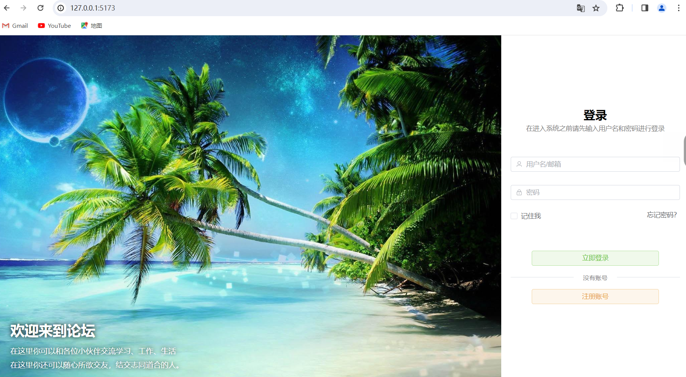

邮箱接受验证码注册新用户

设置隐私
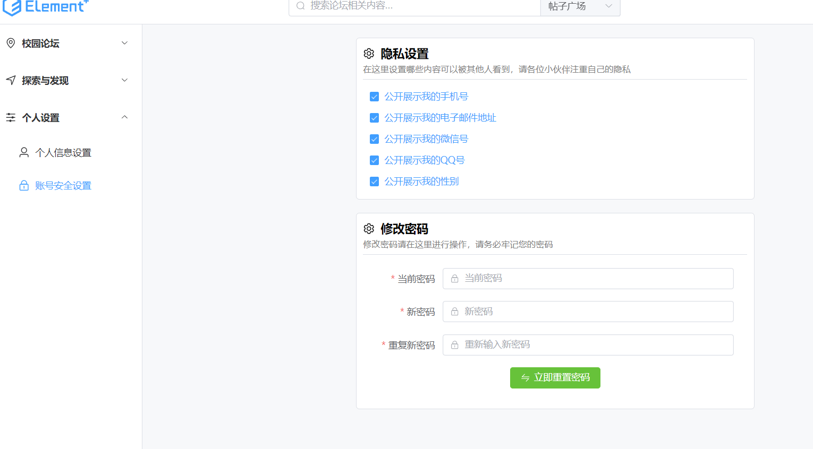

设置个人信息
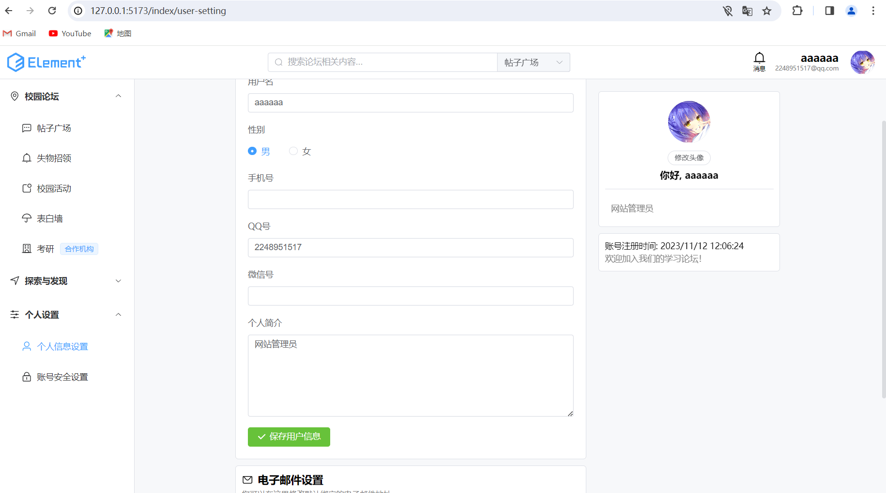

论坛首页
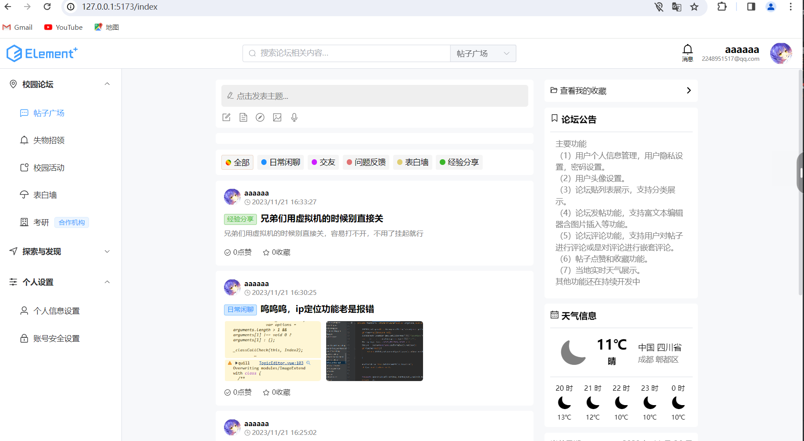

帖子详情
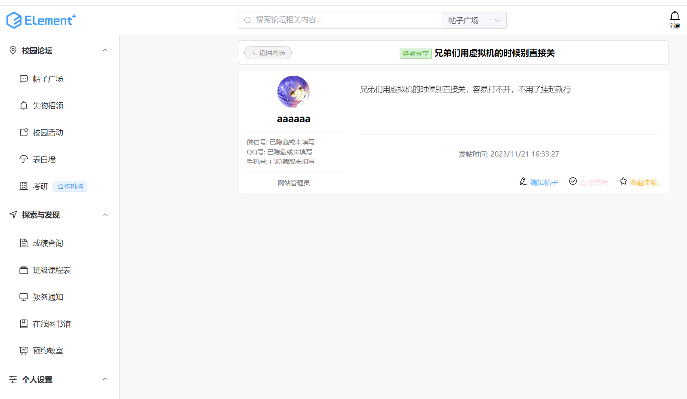

编辑帖子
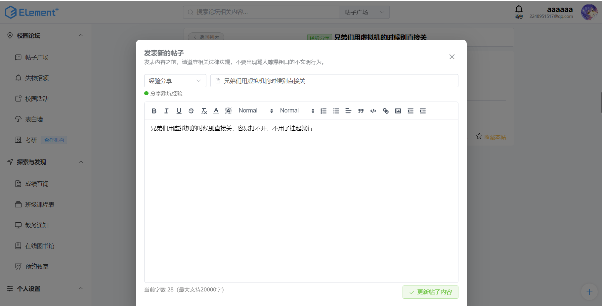

帖子分类筛选
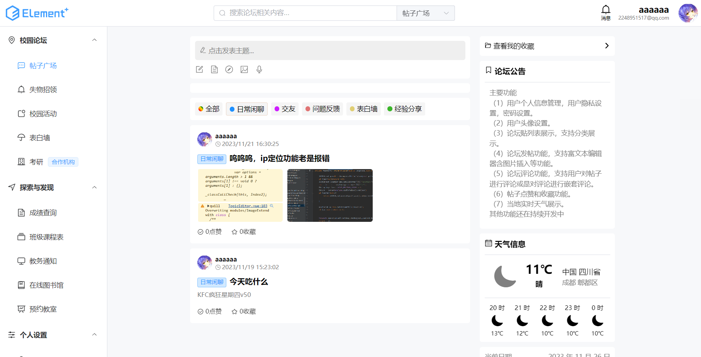

帖子支持图片上传
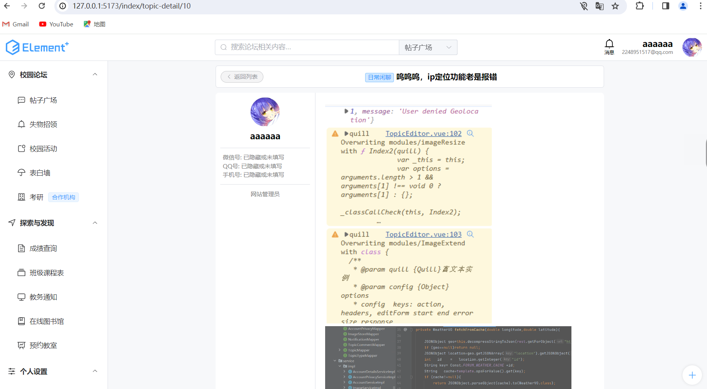

支持嵌套评论
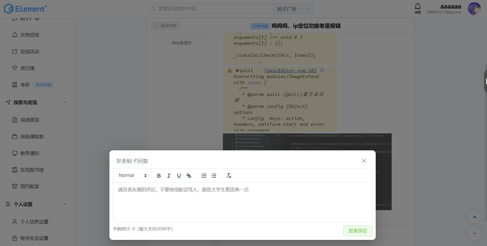

支持点赞收藏
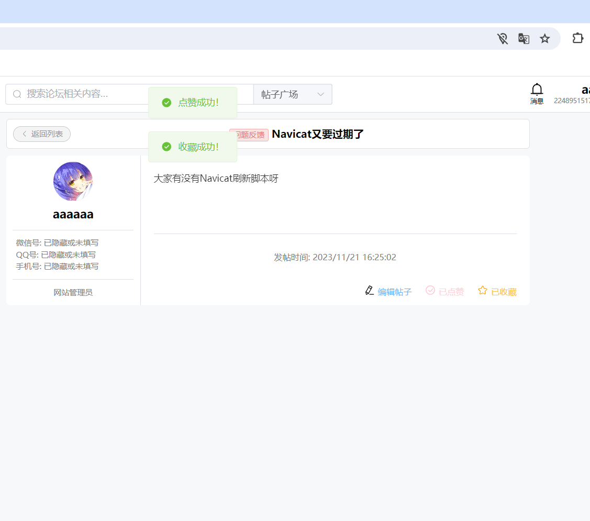

实时天气
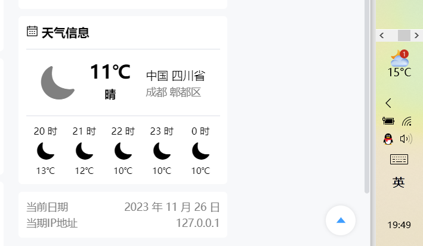

收藏列表
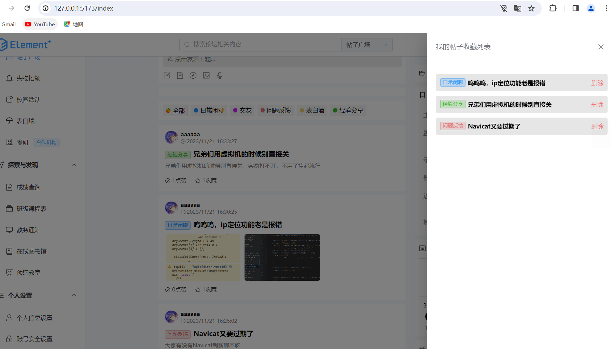