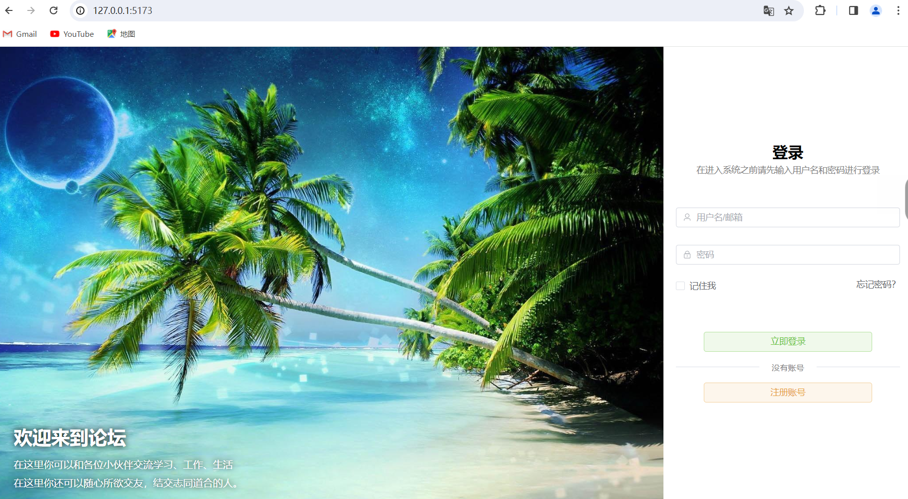
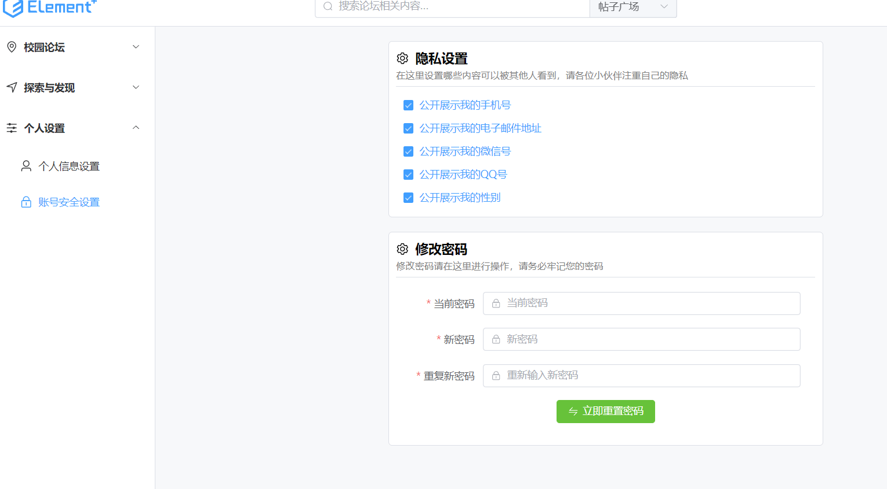
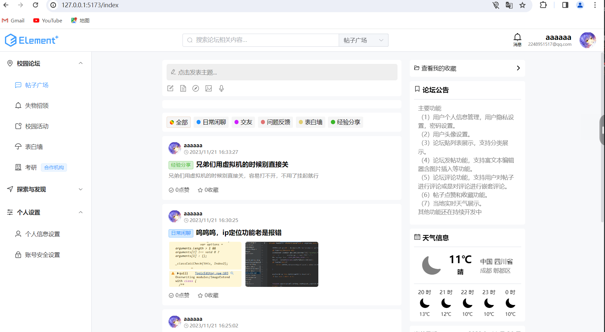
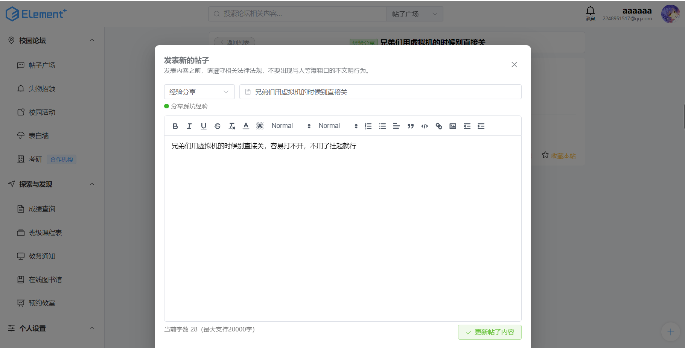
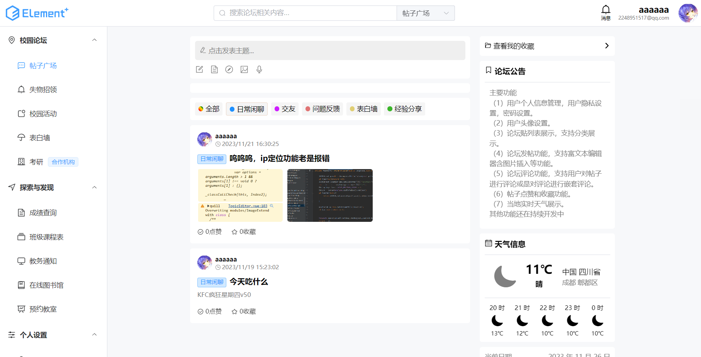
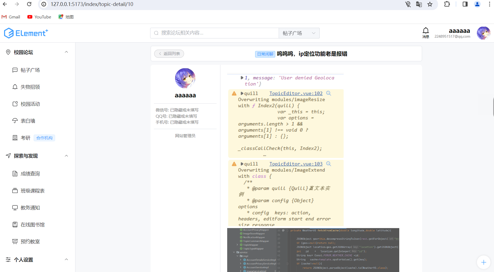
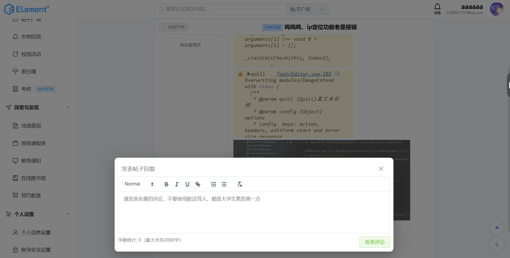
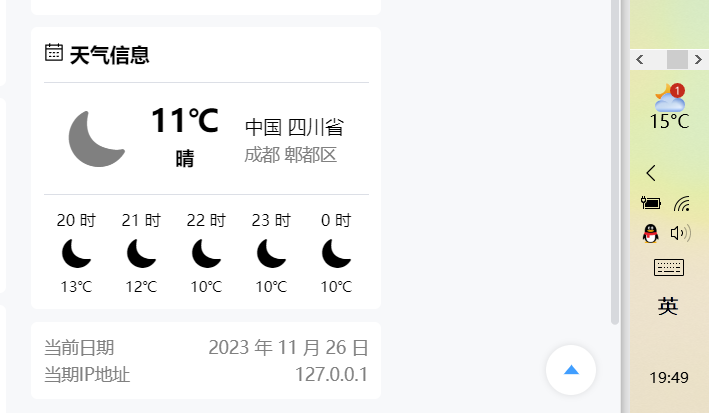
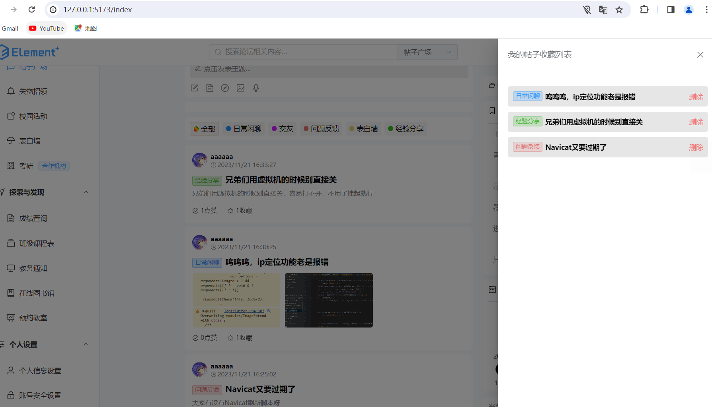

# my-project-frontend

This template should help get you started developing with Vue 3 in Vite.

## Recommended IDE Setup

[VSCode](https://code.visualstudio.com/) + [Volar](https://marketplace.visualstudio.com/items?itemName=Vue.volar) (and disable Vetur) + [TypeScript Vue Plugin (Volar)](https://marketplace.visualstudio.com/items?itemName=Vue.vscode-typescript-vue-plugin).

登录页面

邮箱接受验证码注册新用户

设置隐私

设置个人信息

论坛首页

帖子详情

编辑帖子

帖子分类筛选

帖子支持图片上传

支持嵌套评论

支持点赞收藏

实时天气

收藏列表
